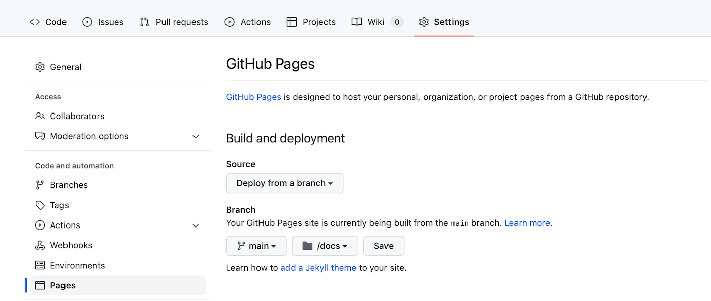
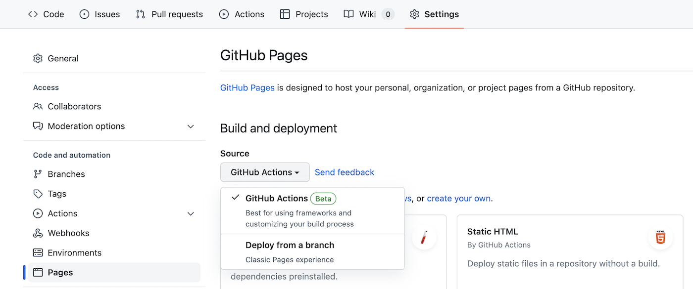
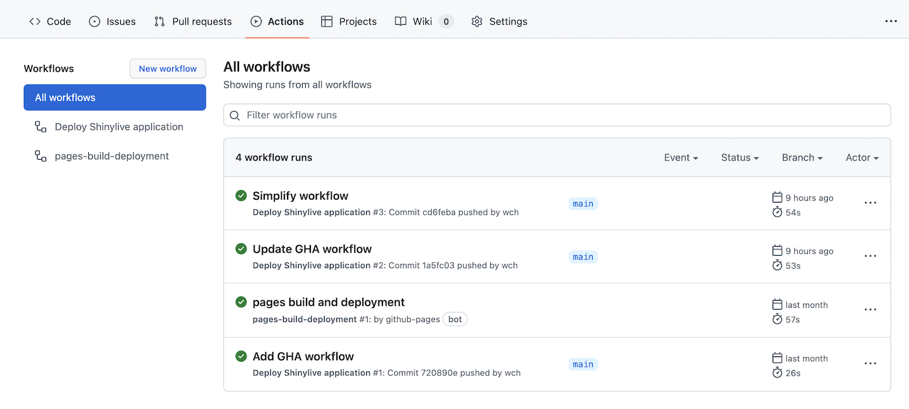

Example Shinylive app deployment on GitHub Pages
================================================

This repository demonstrates how to deploy Shinylive applications to GitHub Pages.

First, make sure you have recent versions of the `shiny` and `shinylive` Python packages:

```bash
pip install shiny shinylive --upgrade
```

Next, create a directory for your project:

```bash
mkdir shinylive-example
cd shinylive-example
git init
```

Then create a Shiny application in `myapp/`:

```bash
shiny create myapp
```

After editing the application, commit it to the repository:

```bash
git add myapp
git commit -m"Add application"
```

At this point, you can [create the repository](https://github.com/new) on GitHub. After you do that, it will show how to push to the repository, with instructions like these (but with different values for `<username>` and `<repo>`). Run those commands to push to the repository:

```bash
git remote add origin https://github.com/<username>/<repo>
git branch -M main
git push -u origin main
```

Now you can use `shinylive export` locally to make sure that your application will work correctly when deployed as a Shinylive application. We'll put the result in a directory named `docs/`, then serve up those files and view them in a web browser:

```
shinylive export myapp docs/
python3 -m http.server --directory docs --port 8008
```

The commands above will serve the site. You can visit it in your web browser at http://localhost:8008/. When you're done, go back to the terminal and press Ctrl-C to stop serving the files.


## Deploying to GitHub Pages

At this point, you have some options for deploying the application to GitHub Pages. Here are two ways of doing it:

1. Commit the `docs/` directory and push to GitHub.
2. Don't commit `docs/`, and instead use GitHub Actions to run `shinylive export` and deploy to GitHub Pages.

The advantage of (1) is that you can be sure that the files served on website are exactly the same as the ones on your local system. You can also be sure that you can always retrieve those exact files in the future if you need them for some reason. The drawback is that the files in `docs/` may be large, because that directory contains Pyodide as well as Python packages used by the application. This is at least 28MB, for a minimal set of packages. If you update to a new version of the Shinylive web assets, it will commit new versions of these files, which can cause the repository to become quite large over time.

The main advantage of (2) is that the repository can remain very small. It will also be rebuilt every time you push commits to GitHub, so you can be sure that the resulting web site is up-to-date with minimal effort. The drawback is that the `docs/` directory is not committed to the repository, so you cannot easily see the exact files that are deployed, nor can you retrieve old versions of the deployed files from the repository.

This example repository uses option (2) to deploy this site: https://wch.github.io/shinylive-example/


### Option 1: Commit `docs/`

GitHub Pages websites can serve files directly from a branch of a repository. To do this, first go to your repository page, then click on **Settings**, then click on **Pages** in the sidebar. Under **Build and Deployment > Source**, it should say **Deploy from a branch**. Under **Branch**, make sure the `main` branch is selected, and set the folder to `/docs`. Then click the **Save** button.




The commit and push the `docs/` directory.

```bash
git add docs
git commit
git push
```

After a short time, the website will be published at `http://<username>.github.io/<repo>`. For example, this repository's website is at https://wch.github.io/shinylive-example/.


### Option 2: Don't commit `docs/`, and build using GitHub Actions

You can use GitHub Actions to [publish to GitHub Pages](https://docs.github.com/en/pages/getting-started-with-github-pages/configuring-a-publishing-source-for-your-github-pages-site#publishing-with-a-custom-github-actions-workflow). (Note that this feature is currently in beta as of 2022-09).

To enable this feature, first go to your repository page, then click on **Settings**, then click on **Pages** in the sidebar. Click on **Build and Deployment > Source**, and change it from **Deploy from a branch** to **GitHub Actions**.



The next step is to configure a GitHub Action to automatically (1) run `shinylive export` and (2) publish the result to GitHub Pages. To do this, copy the [.github/workflows/deploy.yml](.github/workflows/deploy.yml) file from this repository, and add it your repository in the same path.

It is also a good idea to add a `.gitignore` file with the following:

```
docs/
```

This will prevent you from accidentally committing your local copy of `docs/` (which is generated when you run `shinylive export` locally).

After you commit these files and push, the GitHub action should automatically run. You can see the progress in the **Actions** tab of your repository. It will look something like this:



If and when it runs successfully, the website will be published at `http://<username>.github.io/<repo>`. For example, this repository's website is at https://wch.github.io/shinylive-example/.
